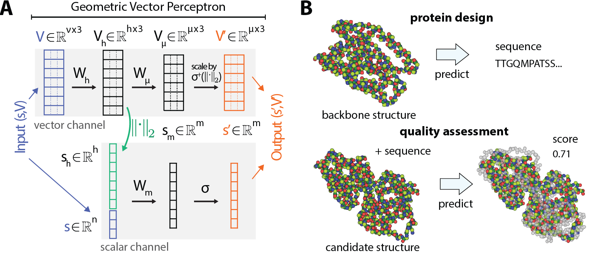
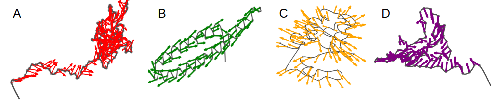

# Geometric Vector Perceptron

Implementation of equivariant GVP-GNNs as described in [Learning from Protein Structure with Geometric Vector Perceptrons](https://openreview.net/forum?id=1YLJDvSx6J4) by B Jing, S Eismann, P Suriana, RJL Townshend, and RO Dror.

This repository serves two purposes. If you would like to use the GVP architecture for structural biology tasks, we provide building blocks for models and data pipelines. If you are specifically interested in protein design as described in the paper, we provide scripts for training and testing models.

**Note:** This repository is an implementation in PyTorch Geometric emphasizing usability and flexibility. The original code for the paper, in TensorFlow, can be found [here](https://github.com/drorlab/gvp). We acknowledge Pratham Soni for portions of the implementation in PyTorch.

<p align="center"></p>

<p align="center"></p>

## Requirements
* UNIX environment
* python==3.6.13
* torch==1.8.1
* torch_geometric==1.7.0
* torch_scatter==2.0.6
* torch_cluster==1.5.9
* tqdm==4.38.0
* numpy==1.19.4
* sklearn==0.24.1

While we have not tested with other versions, any reasonably recent versions of these requirements should work.

## General usage

We provide classes in three modules:
* `gvp`: core GVP modules and GVP-GNN layers
* `gvp.data`: data pipeline functionality for both general use and protein design
* `gvp.models`: implementations of MQA and CPD models as described in the paper

The core modules in `gvp` are meant to be as general as possible, but you will likely have to modify `gvp.data` and `gvp.models` for your specific application, with the existing classes serving as examples.

**Installation:** Download this repository and run `python setup.py develop` or `pip install . -e`. Be sure to manually install `torch_geometric` first!

**Tuple representation:** All inputs and outputs with both scalar and vector channels are represented as a tuple of two tensors `(s, V)`, where the shape of `V` is `[..., n_vector, 3]`. All dimensions should therefore be specified as tuples `(n_scalar, n_vector)`.

**Batching:** We adopt the `torch_geometric` convention of absorbing the batch dimension into the node dimension and keeping track of batch index in a separate tensor.

**Amino acids:** Models view sequences as int tensors and are agnostic to aa-to-int mappings. Such mappings are specified as the `letter_to_num` attribute of `gvp.data.ProteinGraphDataset`. Currently, only the 20 amino acids are supported.

For all classes, see the docstrings for more detailed usage. If you have any questions, please contact bjing@stanford.edu.

### Core GVP classes

The class `gvp.GVP` implements a Geometric Vector Perceptron.
```
import gvp

in_dims = scalars_in, vectors_in
out_dims = scalars_out, vectors_out
gvp_ = gvp.GVP(in_dims, out_dims)
```
The classes `gvp.Dropout` and `gvp.LayerNorm` implement vector-channel dropout and layer norm, while using normal dropout and layer norm for scalar channels. Both expect inputs and return outputs of form `(s, V)`, but will also behave like their scalar-valued counterparts if passed a single tensor.
```
dropout = Dropout(drop_rate=0.1)
layernorm = gvp.LayerNorm(out_dims)
```
The function `gvp.randn` returns tuples `(s, V)` drawn from a standard normal. Such tuples can be directly used in a forward pass.
```
x = gvp.randn(n=5, dims=in_dims)
# x = (s, V) with s.shape = [5, scalars_in] and V.shape = [5, vectors_in, 3]

out = gvp_(x)
out = drouput(out)
out = layernorm(out)
```
Finally, we provide utility functions for adding, concatenating, and indexing into such tuples.
```
y = gvp.randn(n=5, dims=in_dims)
z = gvp.tuple_sum(x, y)
z = gvp.tuple_cat(x, y, dim=-1) # concat along channel axis
z = gvp.tuple_cat(x, y, dim=-2) # concat along node / batch axis

node_mask = torch.rand(5) < 0.5
z = gvp.tuple_index(x, node_mask) # select half the nodes / batch at random
```
### GVP-GNN layers
The class `GVPConv` is a `torch_geometric.MessagePassing` module which forms messages and aggregates them at the destination node, returning new node embeddings. The original embeddings are not updated.
```
nodes = gvp.randn(n=5, in_dims)
edges = gvp.randn(n=10, edge_dims) # 10 random edges
edge_index = torch.randint(0, 5, (2, 10), device=device)

conv = gvp.GVPConv(in_dims, out_dims, edge_dims)
out = conv(nodes, edge_index, edges)
```
The class GVPConvLayer is a `nn.Module` that forms messages using a `GVPConv` and updates the node embeddings as described in the paper. Because the updates are residual, the dimensionality of the embeddings are not changed.
```
layer = gvp.GVPConvLayer(node_dims, edge_dims)
nodes = layer(nodes, edge_index, edges)
```
The class also allows updates where incoming messages where src >= dst are computed using a different set of source embeddings, as in autoregressive models.
```
nodes_static = gvp.randn(n=5, in_dims)
layer = gvp.GVPConvLayer(node_dims, edge_dims, autoregressive=True)
nodes = layer(nodes, edge_index, edges, autoregressive_x=nodes_static)
```
### Loading data 

The class `gvp.data.ProteinGraphDataset` transforms protein backbone structures into featurized graphs. Following [Ingraham, et al, NeurIPS 2019](https://github.com/jingraham/neurips19-graph-protein-design), we use a JSON/dictionary format to specify backbone structures:

```
[
    {
        "name": "NAME"
        "seq": "TQDCSFQHSP...",
        "coords": [[[74.46, 58.25, -21.65],...],...]
    }
    ...
]
```
For each structure, `coords` should be a `num_residues x 4 x 3` nested list of the positions of the backbone N, C-alpha, C, and O atoms of each residue (in that order).
```
import gvp.data

# structures is a list or list-like as shown above
dataset = gvp.data.ProteinGraphDataset(structures)
# dataset[i] is featurized graph corresponding to structures[i]
```
The returned graphs are of type `torch_geometric.data.Data` with attributes
* `x`: alpha carbon coordinates
* `seq`: sequence converted to int tensor according to attribute `self.letter_to_num`
* `name`, `edge_index`
* `node_s`, `node_v`: node features as described in the paper with dims `(6, 3)`
* `edge_s`, `edge_v`: edge features as described in the paper with dims `(32, 1)`
* `mask`: false for nodes with any nan coordinates

The `gvp.data.ProteinGraphDataset` can be used with a `torch.utils.data.DataLoader`. We supply a class `gvp.data.BatchSampler` which will form batches based on the number of total nodes in a batch. Use of this sampler is optional.
```
node_counts = [len(s['seq']) for s in structures]
sampler = gvp.data.BatchSampler(node_counts, max_nodes=3000)
dataloader = torch.utils.data.DataLoader(dataset, batch_sampler=sampler)
```
The dataloader will return batched graphs of type `torch_geometric.data.Batch` with an additional `batch` attibute. The attributes of the `Batch` will then need to be formed into `(s, V)` tuples before passing into a GVP-GNN layer or network.
```
for batch in dataloader:
    batch = batch.to(device) # optional
    nodes = (batch.node_s, batch.node_v)
    edges = (batch.edge_s, batch.edge_v)
    
    out = layer(nodes, batch.edge_index, edges)
```

### Ready-to-use protein GNNs
We provide two fully specified networks which take in protein graphs and output a scalar prediction for each graph (`gvp.models.MQAModel`) or a 20-dimensional feature vector for each node (`gvp.models.CPDModel`), corresponding to the two tasks in our paper. Note that if you are using the unmodified `gvp.data.ProteinGraphDataset`, `node_in_dims` and `edge_in_dims` must be `(6, 3)` and `(32, 1)`, respectively.
```
import gvp.models

# batch, nodes, edges as formed above

mqa_model = gvp.models.MQAModel(node_in_dim, node_h_dim, 
                        edge_in_dim, edge_h_dim, seq_in=True)
out = mqa_model(nodes, batch.edge_index, edges,
                 seq=batch.seq, batch=batch.batch) # shape (n_graphs,)

cpd_model = gvp.models.CPDModel(node_in_dim, node_h_dim, 
                        edge_in_dim, edge_h_dim)
out = cpd_model(nodes, batch.edge_index, 
                 edges, batch.seq) # shape (n_nodes, 20)
```

## Protein design
We provide a script `run_cpd.py` to train, validate, and test a `CPDModel` as specified in the paper using the CATH 4.2 dataset and TS50 dataset. If you want to use a trained model on new structures, see the section "Sampling" below. Note that due to adapting to PyTorch Geometric, the model is slightly different from the original TensorFlow model and the performance slightly poorer.

### Fetching data
Run `getCATH.sh` in `data/` to fetch the CATH 4.2 dataset. If you are interested in testing on the TS 50 test set, also run `grep -Fv -f ts50remove.txt chain_set.jsonl > chain_set_ts50.jsonl` to produce a training set without overlap with the TS 50 test set. 

### Training / testing
To train a model, simply run `python run_cpd.py --train`. To test a trained model on both the CATH 4.2 test set and the TS50 test set, run `python run_cpd --test-r PATH` for perplexity or with `--test-p` for perplexity. Run `python run_cpd.py -h` for more detailed options.

```
$ python run_cpd.py -h

usage: run_cpd.py [-h] [--models-dir PATH] [--num-workers N] [--max-nodes N] [--epochs N] [--cath-data PATH] [--cath-splits PATH] [--ts50 PATH] [--train] [--test-r PATH] [--test-p PATH] [--n-samples N]

optional arguments:
  -h, --help          show this help message and exit
  --models-dir PATH   directory to save trained models, default=./models/
  --num-workers N     number of threads for loading data, default=4
  --max-nodes N       max number of nodes per batch, default=3000
  --epochs N          training epochs, default=100
  --cath-data PATH    location of CATH dataset, default=./data/chain_set.jsonl
  --cath-splits PATH  location of CATH split file, default=./data/chain_set_splits.json
  --ts50 PATH         location of TS50 dataset, default=./data/ts50.json
  --train             train a model
  --test-r PATH       evaluate a trained model on recovery (without training)
  --test-p PATH       evaluate a trained model on perplexity (without training)
  --n-samples N       number of sequences to sample (if testing recovery), default=100
```
**Confusion matrices:** Note that the values are normalized such that each row (corresponding to true class) sums to 1000, with the actual number of residues in that class printed under the "Count" column.

### Sampling
To sample from a `CPDModel`, prepare a `ProteinGraphDataset`, but do NOT pass into a `DataLoader`. The sequences are not used, so placeholders can be used for the `seq` attributes of the original structures dicts.

```
protein = dataset[i]
nodes = (protein.node_s, protein.node_v)
edges = (protein.edge_s, protein.edge_v)
    
sample = model.sample(nodes, protein.edge_index,  # shape = (n_samples, n_nodes)
                      edges, n_samples=n_samples)
```        
The output will be an int tensor, with mappings corresponding to those used when training the model.

## Acknowledgements
Portions of the input data pipeline were adapted from [Ingraham, et al, NeurIPS 2019](https://github.com/jingraham/neurips19-graph-protein-design). We thank Pratham Soni for portions of the implementation in PyTorch.

## Citation
```
@inproceedings{
    jing2021learning,
    title={Learning from Protein Structure with Geometric Vector Perceptrons},
    author={Bowen Jing and Stephan Eismann and Patricia Suriana and Raphael John Lamarre Townshend and Ron Dror},
    booktitle={International Conference on Learning Representations},
    year={2021},
    url={https://openreview.net/forum?id=1YLJDvSx6J4}
}
```
